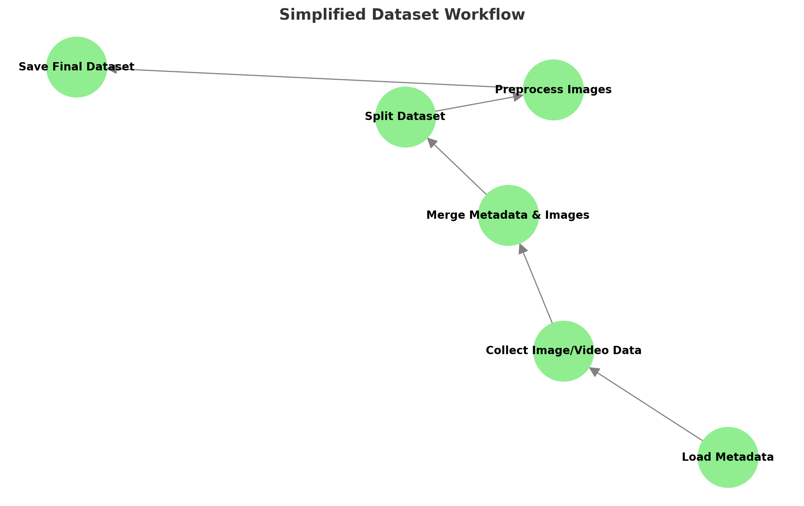

# AI-Driven-Polyp-Classification-and-Risk-Prediction
AI-Driven Real-Time Classification and Risk Prediction of Colorectal Polyps

---

## **Table of Contents**
1. [Abstract](#abstract)
2. [Project Objectives](#project-objectives)
3. [Dataset Description](#dataset-description)
4. [Dataset Preprocessing](#dataset-preprocessing)
5. [Implementation Approach](#implementation-approach)
   - [Multimodal AI Framework](#multimodal-ai-framework)
   - [Fusion Model](#fusion-model)
6. [Goals](#goals)
   - [Goal 1: Classification and Detection](#goal-1-classification-and-detection)
   - [Goal 2: Risk Stratification](#goal-2-risk-stratification)
   - [Goal 3: Demographic and Anatomical Insights](#goal-3-demographic-and-anatomical-insights)
7. [Recommendations](#recommendations)
8. [Future Directions](#future-directions)
9. [Summary](#summary)
10. [License](#license)
---
## **Abstract**
Colorectal cancer is a leading cause of cancer-related deaths worldwide. Early detection and accurate polyp classification are critical for effective treatment and prognosis. Despite advancements, real-time detection and malignancy risk stratification during endoscopy remain challenging. This project leverages the ERCPMP-v5 dataset to enhance real-time polyp detection, classification, and risk prediction, improving clinical decision-making during endoscopic procedures.

---

## **Project Objectives**
The primary goals of this project are:
1. **Classification and Detection:** Automatically classify colorectal polyps based on morphology (Paris classification) and pathology (diagnostic categories such as Tubular, Villous, Adenocarcinoma).
2. **Risk Stratification:** Estimate the likelihood of malignancy for polyps, categorizing them into low, moderate, and high-risk levels.
3. **Demographic and Anatomical Insights:** Identify patterns in polyp characteristics based on age, gender, and anatomical location to refine early screening guidelines.

---

## **Dataset Description**
The ERCPMP-v5 dataset contains detailed endoscopic images, videos, and patient data focused on the morphology and pathology of colorectal polyps. Key details:

- **Patients**: Data from 217 patients.
- **Images & Videos**: 430+ anonymized images and videos.
- **Demographic Data**: Includes patient demographics.
- **Morphological Data**: Classifications based on Paris, Pit, and JNET Classification systems.
- **Pathological Data**: Includes diagnoses like Tubular, Villous, Tubulovillous, Hyperplastic, and more.

  ### **Dataset Link**
[Access the ERCPMP-v5 dataset here](https://data.mendeley.com/datasets/7grhw5tv7n/6/files/72cc0287-84ad-4ade-ae74-8e1e8b30c0a4)

### Contributors
Prepared by experts in Gastroenterology, Hematology, Oncology, and Artificial Intelligence.

---

## **Dataset Preprocessing**
1. **Metadata Preprocessing**: Patinet_ID is the Unique identifier for each patient with morphological and pathological details.
    - Scaled numerical features (e.g., age, polyp size).
    - One-hot encoded categorical features (e.g., dysplasia grade, morphology classification).
2. **Image and Video PreProcessing**: Images and videos are processed to ensure that they are correctly associated with the corresponding Patient_ID.Frames extracted at 2 FPS, resized to 224x224 pixels, and normalized to [0, 1].
3. **Data Merging**: Using Patient_ID as a key, image paths are merged with the metadata. This links each image/frame with the corresponding demographic, morphological, and pathological details.
4. **Splitting the Dataset**:
   - Training Set (60%)
   - Validation Set (20%)
   - Test Set (20%)
5. **Final Dataset Creation**: The final dataset includes:
- Metadata: Patient and polyp-specific information (size, morphology, diagnosis, etc.).
- Image Paths: Linking images/frames to patient metadata.
- Split Information: Indicates whether an entry belongs to training, validation, or test sets.

---

## **Implementation Approach**
### **Multimodal AI Framework**
The Multimodal AI refers to an approach that combines and processes multiple types of data (here text metadata and image data) together to make predictions or provide insights. In this project, Multimodal AI is used to combine:
1. Metadata: Information about the patient (like age, sex) and polyp characteristics (like size, location, and dysplasia grade).
2. Image Features: Detailed information extracted from colonoscopy images or video frames.

By integrating these two types of data, the system creates a more comprehensive understanding of the patient's condition, which helps make better predictions about polyp recurrence and provides tailored surveillance recommendations.

### **Fusion Model**
Fusion Model:
A Fusion Model is a deep learning approach that combines information from multiple sources (or modalities) to make predictions. In this project, it combines:
1. Metadata Features: Information like patient demographics (e.g., age, sex) and polyp characteristics (e.g., size, location, dysplasia grade).
2. Image Features: Detailed visual information extracted from colonoscopy frames using a pre-trained model like Vision Transformer (ViT).

Why Use a Fusion Model?
Multimodal Learning: A fusion model integrates multiple or diverse data types, combining metadata for contextual information (e.g., patient history) with images that capture detailed visual characteristics of polyps. In simple terms, a Fusion Model is like combining two experts—one analyzing patient details and the other examining polyp images—to make the best possible prediction about recurrence risk and follow-up care.

---

## **Dataset Workflow**

---

## **Goals**

### **Goal 1: Classification and Detection**
- **Objective:** Classify polyps based on morphology and pathology.
- **Implementation:**
  - Combined image features (Vision Transformer) and tabular data.
  - Random Forest Classifiers trained for morphology and pathology.
- **Results:**
  - Morphology Classification Accuracy: 94.94%
  - Pathology Classification Accuracy: 99.05%
- **Outputs:** Predicted pathology and morphology categories.
- **Feature Importance:**
- The following plots illustrate the key features contributing to classification accuracy:
  - 1.	Morphology Feature Importance
        - Top features include Pit_I, Size_cm, and Polyp_Location_Sigmoid. 
  - 2.	Pathology Feature Importance
        -	Top features include Pit_I, Pit_2A, and Pit_III. 

  
  

---

### **Goal 2: Risk Stratification**
- **Objective:** Categorize polyps into risk levels (low, moderate, high).
- **Implementation:**
  - Random Forest Classifier trained on metadata and image features.
- **Results:**
  - Accuracy: 99.58%
  - Recall for Malignant Polyps: 96%
  - F1-Score: 0.98
- **Risk Levels:**
  - Low Risk: Probability ≤ 0.3
  - Moderate Risk: Probability 0.3–0.7
  - High Risk: Probability > 0.7

---

### **Goal 3: Demographic and Anatomical Insights**
1. **Average Polyp Size by Anatomical Location**
   

2. **Polyp Type Prevalence by Anatomical Location**
   

3. **Average Polyp Size by Gender**
   

4. **Polyp Type Prevalence by Gender**
   

5. **Polyp Type Prevalence by Age Group**
   

---

## **Recommendations**
- **Demographic Patterns:**
  - Age: Polyps are most prevalent in individuals aged 60–70.
  - Gender: Males show higher prevalence of high-risk polyps.
  - Anatomical Location: High-risk polyps are most prevalent in the Rectum and Ascending Colon.
- **Clinical Implications:**
  - Prioritize screening for males and individuals aged 50+.
  - Closely monitor high-risk regions (Rectum and Ascending Colon).

---

## **Future Directions**
- Integrate demographic factors into predictive models for personalized screening recommendations.
- Explore regional and demographic variations in polyp characteristics.

---

## **Summary**
This project integrates advanced machine learning techniques to enhance colorectal polyp detection, classification, and risk prediction. Key contributions:
- Morphology and pathology classification accuracies of 94.94% and 99.05%.
- Risk stratification with an accuracy of 99.58%.
- Insights into demographic and anatomical factors influencing polyp characteristics.

---

## **License**
  
This project is licensed under the **Attribution 4.0 International (CC BY 4.0)** license. For more information, visit the [Creative Commons License page](https://creativecommons.org/licenses/by/4.0/).

---

## **Workflow Diagram**

---

## **Correlation Insights**

